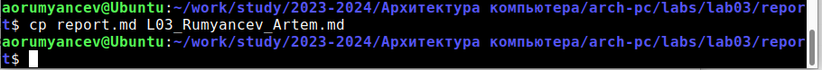

---
## Front matter
title: "Отчёт по лабораторной работе № 3"
subtitle: "Дисциплина: Архитектура компьютера"
author: "Румянцев Артём Олегович"

## Generic otions
lang: ru-RU
toc-title: "Содержание"

## Bibliography
bibliography: bib/cite.bib
csl: pandoc/csl/gost-r-7-0-5-2008-numeric.csl

## Pdf output format
toc: true # Table of contents
toc-depth: 2
lof: true # List of figures
lot: true # List of tables
fontsize: 12pt
linestretch: 1.5
papersize: a4
documentclass: scrreprt
## I18n polyglossia
polyglossia-lang:
  name: russian
  options:
	- spelling=modern
	- babelshorthands=true
polyglossia-otherlangs:
  name: english
## I18n babel
babel-lang: russian
babel-otherlangs: english
## Fonts
mainfont: PT Serif
romanfont: PT Serif
sansfont: PT Sans
monofont: PT Mono
mainfontoptions: Ligatures=TeX
romanfontoptions: Ligatures=TeX
sansfontoptions: Ligatures=TeX,Scale=MatchLowercase
monofontoptions: Scale=MatchLowercase,Scale=0.9
## Biblatex
biblatex: true
biblio-style: "gost-numeric"
biblatexoptions:
  - parentracker=true
  - backend=biber
  - hyperref=auto
  - language=auto
  - autolang=other*
  - citestyle=gost-numeric
## Pandoc-crossref LaTeX customization
figureTitle: "Рис."
tableTitle: "Таблица"
listingTitle: "Листинг"
lofTitle: "Список иллюстраций"
lotTitle: "Список таблиц"
lolTitle: "Листинги"
## Misc options
indent: true
header-includes:
  - \PassOptionsToPackage{english,russian}{babel}
  - \usepackage[english,russian]{babel}
  - \usepackage[utf8]{inputenc}
  - \usepackage{indentfirst}
  - \usepackage{float} # keep figures where there are in the text
  - \floatplacement{figure}{H} # keep figures where there are in the text
---

# Цель работы

Целью данной лабораторной работы является освоение процедуры оформления отчетов с помощью легковесного языка разметки Markdown.

# Задание

    1. Установка необходимого ПО
    2. Заполнение отчета по выполнению лабораторной работы №3 с помощью языка разметки Markdown
    3. Задание для самостоятельной работы

# Теоретическое введение

Markdown - легковесный язык разметки, созданный с целью обозначения форматирования в простом тексте, с максимальным сохранением его читаемости человеком, и пригодный для машинного преобразования в языки для продвинутых публикаций. Внутритекстовые формулы делаются аналогично формулам LaTeX. В Markdown вставить изображение в документ можно с помощью непосредственного указания адреса изображения. Синтаксис Markdown для встроенной ссылки состоит из части [link text], представляющей текст гиперссылки, и части (file-name.md) – URL-адреса или имени файла, на который дается ссылка. Markdown поддерживает как встраивание фрагментов кода в предложение, так и их размещение между предложениями в виде отдельных огражденных блоков. Огражденные блоки кода — это простой способ выделить синтаксис для фрагментов кода

# Выполнение лабораторной работы

##  Заполнение отчета по выполнению лабораторной работы №3 c помощью языка разметки Markdown
Открываю терминал. Перехожу в каталог курса, сформированный при выполнении прошлой лабораторной работы (рис. 1).

Обновляю локальный репозиторий, скачав изменения из удаленного репозитория с помощью команды git pull (рис. 2).

Перехожу в каталог с шаблоном отчета по лабораторной работе №3 с помощью cd (рис. 3).

Компилирую шаблон с использованием Makefile, вводя команду make (рис. 4).

Открываю сгенерированный файл report.docx LibreOffice (рис. 5).

Открываю сгенерированный файл report.pdf (рис. 6). Убедился, что все правильно сгенерировалось.

Удаляю полученные файлы с использованием Makefile, вводя команду make clean (рис. 7). С помощью команды ls проверяю, удалились ли созданные файлы.

Открываю файл report.md с помощью любого текстового редактора mousepad (рис. 8).

Я хочу, чтобы у меня на всякий случай сохранился шаблон отчета, поэтому копирую файл с новым названием с помощью утилиты cp (рис. 9).

Начинаю заполнять отчет с помощью языка разметки Markdown в скопированном файле (рис. 10).

Компилирую файл с отчетом. Загружаю отчет на GitHub.

# Выводы

В результате выполнения данной лабораторной работы я освоил процедуры оформления отчетов с помощью легковесного языка разметки Markdown.

# Список литературы

1.[Архитектура ЭВМ](https://esystem.rudn.ru/pluginfile.php/2091231/mod_resource/content/)
